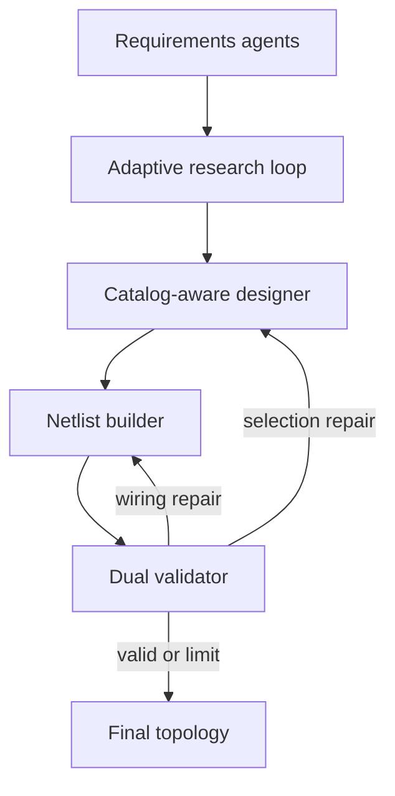

# Architecture

## Goal and boundary

The system converts one hydraulic application statement into:

- structured requirements;
- an evidence-backed topology rationale;
- exact selected catalog component instances;
- explicit port-to-port, external-interface, and terminated-port records; and
- a combined deterministic and engineering validation report.

It ends there. It does not include sizing, a numerical solver, drawing/code
generation, FastAPI, or a browser frontend.

## Why this is a controlled workflow rather than one autonomous agent

Hydraulic topology contains both judgment and hard invariants. LLM agents are
used for ambiguous semantic work: extracting intent, planning research,
synthesizing evidence, choosing a circuit pattern, and reviewing behavior.
Ordinary Python owns facts that should not be negotiable: catalog identity,
exact ports, graph connectivity, pressure/stroke/rough-force compatibility,
research budgets, and loop termination.

This produces a graph with explicit gates instead of one long prompt.

## Agent roles

| Role | Model work | Deterministic guard |
| --- | --- | --- |
| Requirements extractor | Normalizes functions, phases, constraints, criteria | Pydantic schema |
| Requirements critic | Finds blocking ambiguity and safe assumptions | Round limit and terminal interrupt |
| Research planner | Converts design decisions into queries | Minimum need checklist and query budget |
| Parallel research worker | Distills one Tavily result set | URL preservation, task-id preservation, error capture |
| Research coverage critic | Judges whether each need is supported | Requires cited medium/high-confidence evidence for critical needs |
| Research synthesizer | Builds catalog-compatible patterns | Catalog type vocabulary supplied explicitly |
| Design-brief curator | Removes irrelevant prose | Pydantic schema |
| Component designer | Calls catalog tools and selects exact keys | Tool audit trace and exact-key validation |
| Netlist builder | Creates port-level edges | Exact selected-entry port reference |
| Engineering reviewer | Checks behavior/sequence/safety | Independent deterministic validator |

## Adaptive research

The source repository fan-outs a planned set of searches once and immediately
synthesizes them. Here, the research planner first emits explicit
`KnowledgeNeed` records. After every parallel batch, the coverage critic labels
each need `covered`, `partial`, or `missing` and proposes only targeted
follow-ups.

Python then rejects unsupported sufficiency. A critical need counts as covered
only when at least one related finding has a real citation and medium/high
confidence. Duplicate queries are removed. The loop stops only when:

1. all critical needs are supported; or
2. the configured search/round budget is exhausted.

Case 2 stops before design and reports the missing evidence. This is deliberately
bounded: “keep researching” must not become an infinite or unexpectedly costly
loop.

Parallel workers use LangGraph's `Send` pattern and reducer-backed state keys.
The shared `research_findings`, `research_search_log`, query history, and search
counter are append/sum reducers, so parallel updates are safe.

## Catalog access and benchmark leakage control

The supplied Python attachment has 58 entries and also contained seven solved
problem mappings. The packaged runtime copy deliberately strips the solved
mapping section; `hydraulic_mas/catalog.py` imports and exposes only `CATALOG`
and `SOURCES`.
Designer tools provide:

- `list_component_types`;
- `list_components`;
- `search_catalog`;
- `get_component_details`;
- `compare_components`; and
- `get_port_reference`.

There is no runtime `PROBLEM_SOLUTIONS` object and no tool for benchmark answers.
Every final instance must use an exact tool-visible catalog key, and the
validator independently checks it.

## Topology contract

Every component has a stable instance id and exact `catalog_key`. Every catalog
port must have exactly one disposition:

- a `Connection` to another component port;
- an `ExternalInterface` such as three-phase power, a fan supply, a mechanical
  cam, or atmosphere; or
- a physically justified `PortTermination` for the small set of catalog ports
  that may be blocked or unused.

This avoids the common failure where a component appears in a list but is not
actually plumbed.

## Validation layers

The deterministic validator checks:

1. unique ids and exact catalog-key/type agreement;
2. endpoint ids and exact per-entry ports;
3. one disposition per port;
4. minimum tank/pump/relief/actuator/DCV inventory;
5. suction, pressure, relief, return, drain, and both actuator work paths;
6. known pressure and basic flow ratings;
7. cylinder-to-function assignment, stroke, and rough force capacity where
   catalog data permit it;
8. synchronization, load independence, holding, sequence, and other derived
   capability coverage;
9. explicit prohibitions such as electrical pressure sensing; and
10. traceability for every function and blocking catalog gaps.

The engineering reviewer then checks state-dependent behavior that a simple
graph cannot prove: metering direction, valve-state operation, controlled
lowering, automatic transitions, reverse sequencing, forbidden states, and
unjustified complexity.

Errors are tagged by repair scope. Pure wiring errors return directly to the
netlist builder. Selection, safety, or requirement errors return to the
catalog-aware component designer. Valid portions are supplied on repair passes
to reduce regression.

## Model and provider choice

The source repository hard-codes an old Aalto Azure gateway and deployment. This
project instead supports:

- standard OpenAI via `OPENAI_API_KEY`;
- standard Azure OpenAI via Azure environment variables; and
- the Aalto gateway (GPT-5.5 Responses API plus a GPT-4o deployment), standard
  Azure OpenAI, or another OpenAI-compatible gateway selected via
  `OPENAI_API_MODE`.

Models are environment variables, not code constants. The defaults use a
balanced model for design/review and a lower-cost model for extraction and
distillation. Current model availability should always be checked against the
[official OpenAI model catalog](https://developers.openai.com/api/docs/models).

## Persistence and human clarification

The graph compiles with `InMemorySaver` and each run gets a unique `thread_id`.
A blocking requirements question calls `interrupt()`. The terminal collects the
answer and resumes the same thread with `Command(resume=...)`, following the
[official interrupt contract](https://docs.langchain.com/oss/python/langgraph/interrupts).
