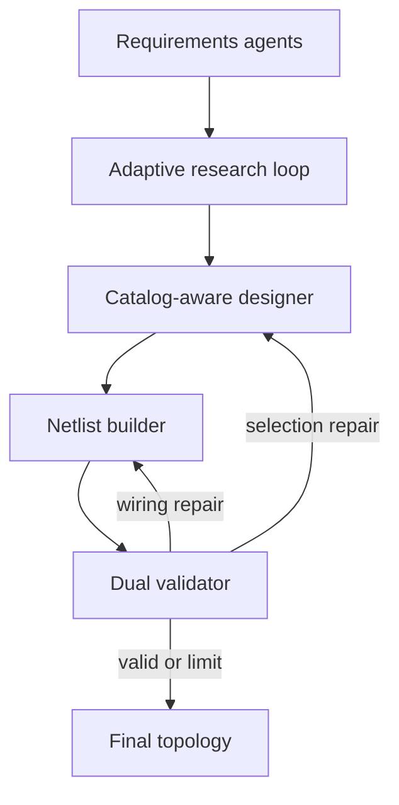

# Architecture

## Goal and boundary

The system converts one hydraulic application statement into:

- structured requirements;
- an evidence-backed topology rationale;
- exact selected generic component-class instances;
- explicit direct port-to-port records; and
- a combined deterministic and engineering validation report.

It ends there. It does not include sizing, a numerical solver, drawing/code
generation, FastAPI, or a browser frontend.

## Why this is a controlled workflow rather than one autonomous agent

Hydraulic topology contains both judgment and hard invariants. LLM agents are
used for ambiguous semantic work: extracting intent, planning research,
synthesizing evidence, choosing a circuit pattern, and reviewing behavior.
Ordinary Python owns facts that should not be negotiable: generic class
identity, exact ports, graph connectivity, forbidden phase-crossing components,
research budgets, and loop termination. Pressure, flow, stroke and force
suitability are intentionally left to the later sizing phase.

This produces a graph with explicit gates instead of one long prompt.

## Agent roles

| Role | Model work | Deterministic guard |
| --- | --- | --- |
| Requirements extractor | Normalizes physical actuators, phases, constraints, criteria | Schema plus structural repair pass |
| Requirements critic | Finds blocking ambiguity and safe assumptions | Duplicate-actuator and phase-scope checks |
| Research planner | Converts deterministic decisions into 3-6 queries | Model-added blockers are discarded |
| Parallel research worker | Ranks candidates, extracts documents, and distills claims | Global URL reservation and source-quality scoring |
| Research coverage critic | Judges whether each need is supported | Verified excerpts and deterministic confidence calibration |
| Research synthesizer | Builds catalog-compatible patterns | Catalog type vocabulary supplied explicitly |
| Design-brief curator | Removes irrelevant prose | Pydantic schema |
| Component designer | Calls catalog tools and selects generic class keys | Tool audit trace and exact-key validation |
| Netlist builder | Creates port-level edges | Exact selected-entry port reference |
| Engineering reviewer | Checks behavior/sequence/safety | Independent deterministic validator |

## Adaptive research

The source repository fan-outs a planned set of searches once and immediately
synthesizes them. Here, the research planner first emits explicit
`KnowledgeNeed` records. After every parallel batch, the coverage critic labels
each need `covered`, `partial`, or `missing` and proposes only targeted
follow-ups.

Search and extraction are separate stages. Tavily first returns candidate URLs;
Python ranks them by authority and relevance, atomically reserves unique URLs
across parallel workers, and extracts only the best documents. Low-quality
sources are rejected. Distilled claims must include an excerpt that Python can
locate in the extracted source text.

Python then recalculates confidence and rejects unsupported sufficiency. A
critical need counts as covered only when verified claim-level evidence supports
the required component, connection, operating, or safety principle. The gate
allows the designer to combine supported principles; it does not demand an
identical pre-existing circuit. The loop stops when:

1. all critical needs are supported; or
2. the configured search/round budget is exhausted; or
3. two rounds produce no new sources.

Case 2 stops before design and reports the missing evidence. This is deliberately
bounded: “keep researching” must not become an infinite or unexpectedly costly
loop.

Parallel workers use LangGraph's `Send` pattern and reducer-backed state keys.
The shared `research_findings`, `research_search_log`, query history, and search
counter are append/sum reducers, so parallel updates are safe. A thread-safe URL
registry and extracted-document cache prevent duplicate retrieval work.

## Catalog access and benchmark leakage control

The original catalog mixed 58 OEM/sizing choices and accessories with topology
functions. The runtime catalog now contains 15 generic functional classes for
the seven bundled prompts and no solved-problem mapping. It contains no
manufacturer/model, rating, dimension or calculated-duty fields.
Designer tools provide:

- `list_component_types`;
- `list_components`;
- `search_catalog`;
- `get_component_details`;
- `compare_components`; and
- `get_port_reference`.

There is no runtime `PROBLEM_SOLUTIONS` object and no tool for benchmark answers.
Every final instance must use an exact tool-visible generic key, and the
validator independently checks it. Layout/accessory types are rejected even if
an agent attempts to invent a key.

## Topology contract

Every component has a stable instance id and exact generic `catalog_key`. Every
catalog port must occur in at least one `Connection` to another component port.
A port may occur in multiple connections: this is the explicit representation
of a hydraulic branch, so no tee or manifold component is needed. Solenoid and
mechanical-position operation are catalog properties and do not create
electrical, shaft or external-interface components.

This avoids the common failure where a component appears in a list but is not
actually plumbed.

## Validation layers

The deterministic validator checks:

1. unique ids and exact catalog-key/type agreement;
2. endpoint ids and exact per-entry ports;
3. complete direct connection accounting, while allowing repeated branch ports;
4. minimum tank/pump/relief/actuator/DCV inventory;
5. suction, pressure, relief, return, pilot/drain, and both actuator work paths;
6. explicit rejection of manifolds, tees, accessories, lines and drive hardware;
7. cylinder-to-function assignment without bore/stroke/force sizing;
8. synchronization, load independence, holding, sequence, and other derived
   capability coverage;
9. explicit prohibitions such as electrical pressure sensing; and
10. traceability for every function and topology-scoped catalog gaps.

It never checks pump flow/displacement, valve ratings, cylinder dimensions or
force, reservoir size, lines, filters, cooling or power. The engineering review
prompt has the same boundary so sizing uncertainty cannot invalidate topology.

The engineering reviewer then checks state-dependent behavior that a simple
graph cannot prove: metering direction, valve-state operation, controlled
lowering, automatic transitions, reverse sequencing, forbidden states, and
unjustified complexity.

Errors are tagged by repair scope. Pure wiring errors return directly to the
netlist builder. Selection, safety, or requirement errors return to the
catalog-aware component designer. Valid portions are supplied on repair passes
to reduce regression.

## Model and provider choice

The source repository hard-codes an old Aalto Azure gateway and deployment. This
project instead supports:

- standard OpenAI via `OPENAI_API_KEY`;
- standard Azure OpenAI via Azure environment variables; and
- the Aalto gateway (GPT-5.5 Responses API plus a GPT-4o deployment), standard
  Azure OpenAI, or another OpenAI-compatible gateway selected via
  `OPENAI_API_MODE`.

Models are environment variables, not code constants. The defaults use a
balanced model for design/review and a lower-cost model for extraction and
distillation. Current model availability should always be checked against the
[official OpenAI model catalog](https://developers.openai.com/api/docs/models).

## Persistence and human clarification

The graph compiles with `InMemorySaver` and each run gets a unique `thread_id`.
A blocking requirements question calls `interrupt()`. The terminal collects the
answer and resumes the same thread with `Command(resume=...)`, following the
[official interrupt contract](https://docs.langchain.com/oss/python/langgraph/interrupts).
