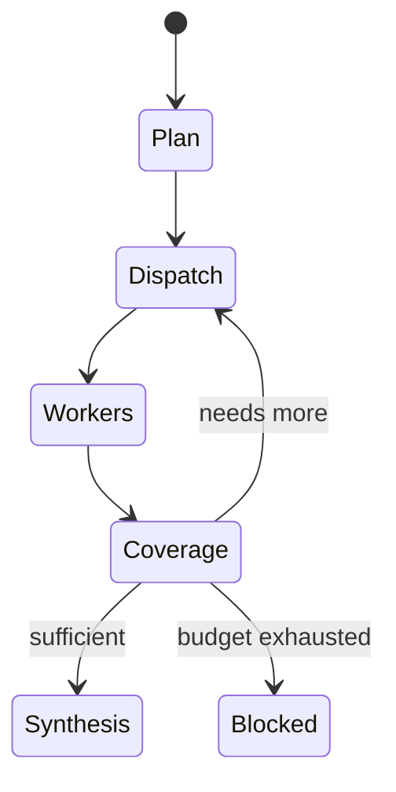

# Execution Flow

## 1. CLI input

`run_topology.py` loads either one bundled id, all bundled problems, or custom
text. It builds initial state with separate limits for requirement clarification,
web research, and topology repair. A new `thread_id` isolates each problem.

## 2. Requirements loop

1. `extract_requirements` converts the text into `RequirementsSpec`.
2. `critique_requirements` checks coverage, contradictions, load character,
   safety, acceptance criteria, typed metering mappings, load control, and
   synchronization strategy.
3. A deterministic structural check detects phases incorrectly split into
   multiple functions or load-independence applied to the wrong phases;
   `repair_requirements` gets one correction pass when needed.
4. If a truly blocking question remains, `clarify_requirements` interrupts the
   graph. The terminal asks the user and resumes the same node/thread.
5. `finalize_requirements` merges noncritical assumptions and records whether
   unresolved ambiguity remains. Unresolved circuit-changing ambiguity now ends
   at `requirements_failure`; it cannot silently enter design.

The extractor reruns after clarification so the answer is normalized into the
same source-of-truth schema.

## 3. Research loop

1. `plan_research` receives the requirements plus a deterministic minimum
   checklist. It emits `KnowledgeNeed` and `ResearchTask` objects.
2. `research_dispatch` trims the batch to the remaining search budget and
   increments the research round.
3. A conditional edge returns one `Send("web_research_worker", ...)` per task.
   LangGraph runs independent workers in parallel.
4. Each worker searches for candidates, ranks source quality, reserves unique
   URLs, extracts the best documents, and asks the distiller for claim-level
   evidence. Search failures become explicit low-confidence findings.
5. Reducers merge worker findings, raw search logs, query history, and the search
   count.
6. `assess_research_coverage` evaluates every need. Python verifies evidence
   excerpts, requires connection/placement plus operating/safety support for a
   circuit pattern, recalculates confidence, and enforces novelty and budgets.
7. If critical needs remain, only follow-up tasks for those needs return to step
   2. If evidence is sufficient, execution continues. If the budget is exhausted,
   `research_failure` ends the graph before design.
8. `synthesize_research` converts supported evidence into component-class and
   port-level pattern guidance, constrained to catalog types.

After topology validation, an error explicitly scoped as unsupported research
may create a new `KnowledgeNeed` in `targeted_research` and re-enter dispatch.
The same global round/search limits still apply.

## 4. Topology design

1. `curate_design_brief` compresses the full spec into circuit-changing facts.
   Python then overwrites its phase decisions with canonical values from
   requirements.
2. `plan_components` runs a LangChain tool-using agent. It must list catalog
   types, search/shortlist generic classes, inspect chosen states/ports, and
   return two or three candidate component/connection plans with exact keys.
   All tool calls and results are printed in the terminal.
3. Python applies executable repair actions, rejects ineligible candidates, and
   selects the highest-scoring valid plan. A bad model preference cannot override
   missing check/unloading/counterbalance or a blocking catalog gap.
4. `build_netlist` receives only the selected class metadata and exact ports. It
   creates direct component edges, function implementations and evidence-linked
   decisions. It also emits one `PhaseConfiguration` per motion phase with exact
   DCV/control-valve state ids. Repeated endpoints represent branches; no
   manifold or tee is inserted.
5. Python re-injects the canonical motion and synchronization records so the
   builder cannot reinterpret `metering_side` or chamber placement.

The component plan and netlist are separate on purpose: component choice is a
design judgment; exact port accounting is a mechanical construction task.

## 5. Validation and repair

`validate_topology` first runs pure Python checks. For each phase it builds a
separate directed graph from bidirectional physical lines plus only the selected
component-state paths. It proves:

- pump supply to the commanded chamber;
- opposite-chamber exhaust to tank;
- the exact metered direction and compensation class;
- absence of an active bypass around metering;
- pilot release and counterbalance placement;
- pressure/position sequence state changes;
- forbidden-function inactivity; and
- selected rigid-parallel, explicit-series, or divider synchronization rules.

The topology and deterministic report then go to the engineering reviewer. The
combined report sets:

- `verdict`: valid or invalid;
- `repair_scope`: none, wiring, selection, or research; and
- `topology_round`: the current build attempt.

Routing is deterministic:

| Result | Next node |
| --- | --- |
| Valid | `finalize_topology` |
| Wiring-only error and rounds remain | `build_netlist` |
| Selection/safety/behavior error and rounds remain | `plan_components` |
| Unsupported plausible pattern and research budget remains | `targeted_research` → research loop |
| Repair limit reached | `finalize_topology` with `unresolved` status |

`ComponentPlan.repair_actions` supports add/delete/replace component and
add/delete/replace connection operations. Deletion is deterministic: a target
flagged as unjustified is removed even if the model accidentally leaves it in
the returned full candidate.

## 6. Final terminal output

`finalize_topology` enriches every selected instance only with its generic class
name, key, type, ports and functional role. It prints:

- final status and narrative;
- selected-component table;
- direct connections in `Component.port -> Component.port` form;
- typed phase metering/load-control decisions;
- exact per-phase component states and active/forbidden functions;
- candidate scores and executed repair history;
- function coverage and design decisions;
- complete research coverage;
- every deterministic check and engineering issue; and
- the complete machine-readable JSON.

The final scope statement explicitly defers all component sizing, ratings,
accessories, line selection, cooling, simulation and fabrication decisions.

Unless `--no-save` is used, the same JSON is written below `runs/`.

## Important state fields

| State field | Writer | Consumer |
| --- | --- | --- |
| `requirements` | extractor/finalizer | every downstream phase |
| `knowledge_needs` | research planner | coverage gate and synthesizer |
| `research_findings` | parallel workers, append reducer | coverage/synthesis |
| `research_query_history` | parallel workers, append reducer | duplicate prevention |
| `searches_used` | parallel workers, sum reducer | budget gate |
| `research_stalled_rounds` | coverage guard | no-novelty termination |
| `research_coverage` | coverage critic + Python guard | router and final output |
| `component_candidates` | catalog-aware designer | deterministic candidate selector/terminal |
| `candidate_evaluations` | deterministic selector | final output/terminal |
| `component_plan` | catalog-aware designer | netlist builder |
| `catalog_tool_trace` | component designer wrapper | terminal audit |
| `repair_history` | component selector/repair pass | final output/terminal |
| `topology` | netlist builder | validators and finalizer |
| `topology_validation` | combined validator | repair router/finalizer |
| `final_output` | finalizer | terminal and JSON file |
